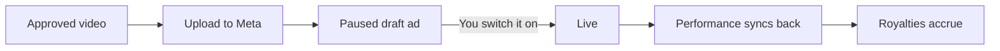

## What this does

Publishing takes an approved video and creates a real ad in **your** Meta ad account, with the creative uploaded and the ad wired to an adset.

<Callout kind="warning">
  Ads are created **paused**. Hotline never turns an ad on, never sets a budget and never changes a bid. Nothing here can start spending your money.
</Callout>

## Before you start

- Meta connected in **Settings**, with an ad account selected
- A video in **Hub** with the status Approved

## Publish one video

<Steps>
  <Step title="Open the approved video" icon="play-circle">
    In **Hub**, find the approved creative you want to run.
  </Step>

  <Step title="Choose Upload to Meta" icon="send">
    Set the **Ad Account** and the **Ad Name**. The ad name is what you will see in Ads Manager, so name it the way your account is already organised.
  </Step>

  <Step title="Decide where it sits" icon="layers">

  Three options, depending on what you are doing:

  - **Duplicate Adset**, copy an existing adset's targeting and put the new ad in the copy. The usual choice for testing a new creative against a proven audience.
  - **Existing Adset**, drop the ad into an adset that is already running.
  - **Use Template**, build the adset from a saved template.

  </Step>

  <Step title="Publish" icon="check">
    Hotline uploads the video, creates the creative, and creates the ad paused. It then appears in Ads Manager ready for you to review and switch on.
  </Step>
</Steps>

## Publish several at once

Bulk upload takes a set of approved creatives in one pass, which is how a batch of variants normally ships. The same choices apply, made once for the batch.

## After it is live

Once you turn the ad on in Meta, performance flows back into Hotline every two hours: spend, impressions, clicks, reach, video plays, purchases and purchase value, attached to that specific video and the creator who made it.

Royalties then accrue nightly against the terms frozen on that video.

## Related

<Columns cols={2}>
  <Card title="Integrations" icon="plug" href="/integrations" horizontal>
    What Meta permissions are requested and why.
  </Card>
  <Card title="Features" icon="star" href="/features" horizontal>
    How attribution and royalties work once an ad is running.
  </Card>
</Columns>
