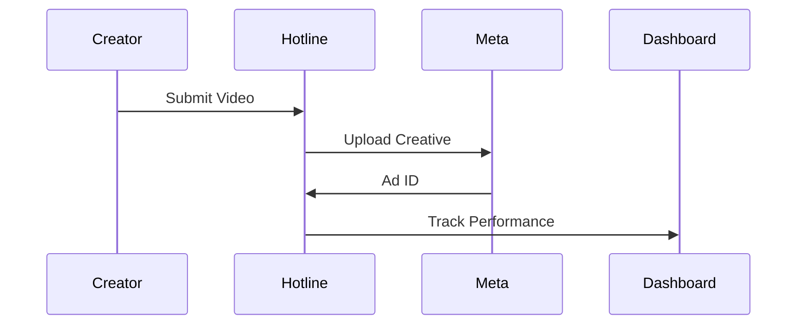

## Overview

Hotline UGC integrates seamlessly with your favorite e-commerce and marketing tools. Connect Shopify to pull product data automatically, upload videos directly to Meta Ads Manager, sync customer events with Klaviyo, and handle creator royalties via Stripe. These integrations streamline your UGC workflow from briefing creators to performance tracking.

<Columns cols={2}>
  <Card title="Shopify" icon="shopping-cart" href="#shopify">
    Sync product catalogs and inventory in real-time.
  </Card>
  <Card title="Meta Ads" icon="facebook" href="#meta">
    Upload and manage ad creatives directly.
  </Card>
  <Card title="Klaviyo" icon="mail" href="#klaviyo">
    Trigger personalized campaigns based on UGC performance.
  </Card>
  <Card title="Stripe" icon="credit-card" href="#stripe">
    Automate royalty payouts to creators.
  </Card>
</Columns>

<Callout kind="info">
  Ensure you have admin access to each platform before starting. All integrations use secure OAuth or API keys.
</Callout>

## Integration Workflows

Use the following tabs to set up each integration. Each process takes under 5 minutes.

<Tabs>
  <Tab title="Shopify" icon="shopping-cart">

## Prerequisites

- Active Shopify store
- Hotline UGC account with admin permissions

<Steps>
  <Step title="Install App" icon="download">
    Visit the Shopify App Store, search for "Hotline UGC", and click **Install**.
  </Step>
  <Step title="Authorize Access" icon="key">
    Grant permissions for products, orders, and inventory. Hotline UGC only reads data.
  </Step>
  <Step title="Sync Products" icon="refresh-cw">
    In your Hotline dashboard, go to **Settings > Integrations > Shopify** and click **Sync Now**.
  </Step>
</Steps>

<CodeGroup tabs="Webhook,API">
````javascript
// Webhook for new orders
fetch('https://api.hotlineugc.com/webhooks/shopify/order-created', {
  method: 'POST',
  headers: { 'Authorization': 'Bearer YOUR_API_KEY' },
  body: JSON.stringify(orderData)
});
````
````bash
# API call to fetch products
curl -X GET 'https://api.hotlineugc.com/shopify/products' \
  -H 'Authorization: Bearer YOUR_API_KEY'
````
</CodeGroup>

  </Tab>

  <Tab title="Meta Ads" icon="facebook">

## Prerequisites

- Meta Business Manager account
- Ads account with creative permissions

<Steps>
  <Step title="Connect Account" icon="link">
    Navigate to **Settings > Integrations > Meta** in Hotline UGC.
  </Step>
  <Step title="Authenticate" icon="shield">
    Click **Connect Meta**, log in, and select your ad account.
  </Step>
  <Step title="Upload Video" icon="upload">
    Select a creator video in the **Hub**, then **Publish to Meta**. It auto-optimizes for ads.
  </Step>
</Steps>



  </Tab>

  <Tab title="Klaviyo" icon="mail">

## Sync Marketing Events

Push UGC performance data to Klaviyo for targeted flows.

<Steps>
  <Step title="Get API Key" icon="key">
    In Klaviyo, go to **Settings > API Keys** and create a private key.
  </Step>
  <Step title="Configure in Hotline" icon="settings">
    Enter the key in **Hotline > Settings > Klaviyo**.
  </Step>
  <Step title="Test Event" icon="play">
    Trigger a test event from **Analytics > Export** to verify sync.
  </Step>
</Steps>

<ParamField header="X-Klaviyo-API-Key" param-type="string" required="true">
  Your private API key from Klaviyo.
</ParamField>

  </Tab>

  <Tab title="Stripe" icon="credit-card">

## Automated Payouts

Set up Stripe Connect for seamless creator payments based on revenue.

<Steps>
  <Step title="Enable Stripe Connect" icon="toggle-right">
    Go to **Settings > Payouts > Stripe** and enable.
  </Step>
  <Step title="Connect Stripe Account" icon="link">
    Creators onboard via Stripe Express during briefing.
  </Step>
  <Step title="Configure Royalties" icon="percent">
    Set payout rules (e.g., 10% of tracked revenue) in **Payouts**.
  </Step>
</Steps>

<Expandable title="Advanced Payout Rules" default-open="false">

Define custom thresholds:

````javascript
// Example royalty calculation
const royalty = (revenue * 0.10) > 300 ? revenue * 0.10 : 0;
````

</Expandable>

  </Tab>
</Tabs>

## Next Steps

After setup, monitor integrations in the **Analytics** dashboard. Use webhooks for real-time updates.

<Board title="Integration Status">
  <BoardColumn title="Connected" color="2" icon="check-circle">
    <BoardCard title="Shopify Sync" description="Products updating every 15min" icon="shopping-cart" />
    <BoardCard title="Meta Uploads" description="5 creatives live" icon="facebook" />
  </BoardColumn>
  <BoardColumn title="Pending" color="1" icon="loader">
    <BoardCard title="Klaviyo Events" dueDate="2024-12-15" />
  </BoardColumn>
  <BoardColumn title="Needs Review" color="0" icon="alert-triangle">
    <BoardCard title="Stripe Payouts" description="Verify tax forms" author="Finance" />
  </BoardColumn>
</Board>

<Callout kind="tip">
  Test each integration with sample data before going live. Contact support@hotlineugc.com for issues.
</Callout>