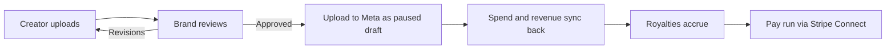

<Image src="https://blob-cdn.documentation.ai/org-2ebb2ef5-dd91-493f-9938-283fbdb14c81/doc-d2a73d2e-4391-4446-a5c8-2d0b41b7c4c1/1774416384221-0wlxa0j3sb2i-Image-5.png?q=85&fm=auto&auto=compress%2Cformat" alt="Hotline UGC documentation" width="800" height="400" />

## What Hotline UGC is

Hotline UGC is software for direct to consumer brands and agencies that already buy Meta ads.

It runs the creator pipeline in one workspace: submissions, review and revisions, then a one click upload that writes approved videos into the brand's own Meta ad account as paused draft ads. From there Meta spend and revenue sync back against the individual video and the creator who made it, royalties accrue on terms the brand sets, and balances go out through Stripe Connect.

The brand keeps its ad account, its pixel and its audiences. Hotline never touches the media spend.

## What it is not

Hotline is not a marketplace, an agency or a roster. It does not sell videos, source creators on your behalf, or take a percentage of ad spend. There is no creator discovery directory.

You bring creators you already work with, or invite new ones, and Hotline runs the workflow, the attribution and the payments around them.

## The two sides

Both sides read the same numbers for a given video, which is what makes a royalty a fact rather than a matter of trust.

<Columns cols={2}>
  <Card title="For brands" icon="building-2">
    Review submissions, push approved videos to Meta, watch spend and revenue land against each creative, and pay royalties on a schedule.
  </Card>
  <Card title="For creators" icon="users">
    Upload against a brief, see impressions, clicks and earnings for your own videos, and cash out to your own Stripe account.
  </Card>
</Columns>

<Callout kind="info">
  Creators see performance and earnings for their own videos only. They never see account wide spend, ROAS, or any other creator on the roster.
</Callout>

## How the work flows

## Where to start

<Columns cols={2}>
  <Card title="Quickstart" icon="rocket" href="/quickstart" horizontal>
    Set up a workspace, connect Meta, and take a video from upload to a live ad.
  </Card>
  <Card title="Features" icon="star" href="/features" horizontal>
    What the platform actually does, surface by surface.
  </Card>
  <Card title="Integrations" icon="plug" href="/integrations" horizontal>
    Meta, Shopify and Stripe: what each one connects and what it can see.
  </Card>
  <Card title="Help Center" icon="help-circle" href="/help-center" horizontal>
    Answers to common questions and fixes for common problems.
  </Card>
</Columns>
