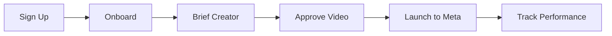

## Prerequisites

Before starting, ensure you have the following ready:

<Callout kind="info">

- A Meta Business Manager account with Ads permissions
- Access to your Shopify store (if integrating)
- An active Stripe account for payouts
- Your brand guidelines and creative brief details

</Callout>

## Sign Up and Onboard

Follow these steps to create your Hotline UGC account and complete the setup wizard.

<Steps>
  <Step title="Create Account" icon="user-plus">

  Visit [hotlineugc.com](https://hotlineugc.com/) and click **Join the Waitlist** or **Sign Up**.

  Fill in your email and create a password. Hotline UGC sends a verification email immediately.

  </Step>

  <Step title="Verify Email" icon="mail">

  Check your inbox for the verification email from Hotline UGC.

  Click the verification link to activate your account.

  <Callout kind="tip">
    Didn't receive the email? Check your spam folder or resend from the login page.
  </Callout>

  </Step>

  <Step title="Complete Onboarding Wizard" icon="settings">

  Log in to your dashboard at [app.hotlineugc.com](https://app.hotlineugc.com).

  The wizard guides you through:

  - Connecting your Meta Ads account
  - Linking Shopify (optional for e-commerce tracking)
  - Setting up Klaviyo for email flows
  - Configuring Stripe for creator royalties

  Follow the prompts and authorize each integration.

  </Step>
</Steps>

## Create Your First Creator Brief

Once onboarded, brief your first creator directly from the dashboard.

<Tabs>
  <Tab title="Dashboard Brief" icon="activity">

  Navigate to **Hub > Briefs** in the sidebar.

  <Steps>
    <Step title="New Brief">

    Click **New Creator Brief**.

    Enter details like hook script, product info, and payout cap (e.g., A$300).

    </Step>

    <Step title="Assign Creator">

    Select from **Top Performing Creatives** or invite a new one via email.

    </Step>
  </Steps>

  </Tab>

  <Tab title="API Brief" icon="code">

  Use the API to automate briefs for scale.

  <CodeGroup tabs="cURL,JavaScript">
  ````bash
  curl -X POST https://api.hotlineugc.com/v1/briefs \
    -H "Authorization: Bearer YOUR_API_KEY" \
    -H "Content-Type: application/json" \
    -d '{
      "title": "Morning Routine Hook",
      "script": "Show your morning routine with our product",
      "payoutCap": 300,
      "currency": "AUD"
    }'
  ````

  ````javascript
  const response = await fetch('https://api.hotlineugc.com/v1/briefs', {
    method: 'POST',
    headers: {
      'Authorization': 'Bearer YOUR_API_KEY',
      'Content-Type': 'application/json',
    },
    body: JSON.stringify({
      title: 'Morning Routine Hook',
      script: 'Show your morning routine with our product',
      payoutCap: 300,
      currency: 'AUD'
    })
  });
  ````
  </CodeGroup>

  </Tab>
</Tabs>

## Approve and Launch to Meta Ads

Review the submitted video and ship it to Meta.

<Steps>
  <Step title="Review Creative" icon="play-circle">

  Go to **Hub > Creatives**.

  Preview the video, check hook rate, and performance metrics like ROAS.

  </Step>

  <Step title="Approve & Upload" icon="upload">

  Click **Approve** and select **Upload to Meta**.

  Choose your ad account and variants (e.g., 3 variants).

  Track spend, revenue, and royalties in **Analytics**.

  </Step>
</Steps>

<Callout kind="success">
  Congratulations! Your first UGC ad is live. Monitor performance in the dashboard.
</Callout>

## Next Steps

<Columns cols={2}>
  <Card title="Integrations" icon="link" href="/integrations">
    Connect Shopify, Klaviyo, and Stripe for full automation.
  </Card>

  <Card title="Analytics" icon="bar-chart-3" href="/analytics">
    Dive into ROAS, CPA, and creator payouts.
  </Card>

  <Card title="Payouts" icon="dollar-sign" href="/payouts">
    Manage royalties based on actual revenue.
  </Card>

  <Card title="Best Practices" icon="book-open" href="/guides">
    Tips for high-performing UGC briefs.
  </Card>
</Columns>

