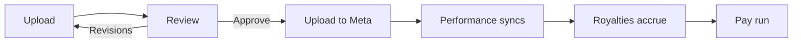

## Before you start

<Callout kind="info">

- A Meta Business Manager account with permission to manage the ad account you want to use
- A Stripe account, if you intend to pay creators through Hotline
- A Shopify store, only if you want to send creators free product

</Callout>

Shopify and Stripe can wait. Meta is the one connection the core loop depends on.

## Create your workspace

<Steps>
  <Step title="Sign up" icon="user-plus">

  Go to [app.hotlineugc.com](https://app.hotlineugc.com) and create an account with an email address and password, or with Google or Apple.

  </Step>

  <Step title="Onboarding" icon="settings">

  The wizard asks for three things and nothing else:

  - **Your profile**, a name and a photo
  - **Your workspace**, a brand name and the URL you will use, for example `app.hotlineugc.com/your-brand`
  - **A plan**

  </Step>

  <Step title="Choose a plan" icon="credit-card">

  The workspace stays locked until a plan is chosen. New subscriptions start with a 7 day trial, and the tiers differ on how many creators and team members a workspace may hold. See [Plans and limits](/plans).

  </Step>
</Steps>

<Callout kind="tip">
  Integrations are not part of onboarding. You connect them afterwards, from **Settings**, in whatever order suits you.
</Callout>

## Connect Meta

Go to **Settings** and find the Meta card.

<Steps>
  <Step title="Authorise" icon="shield">

  Click through the Meta login and grant access to the ad account you want Hotline to publish into.

  </Step>

  <Step title="Pick the ad account" icon="link">

  Select which ad account this workspace uses. Everything Hotline publishes goes here, and every figure it reads comes from here.

  </Step>
</Steps>

<Callout kind="warning">
  Hotline publishes ads as **paused drafts**. Nothing goes live until somebody turns it on in Meta, so connecting the integration cannot start spending your money.
</Callout>

## Set your royalty terms

Still in **Settings**, open the royalty terms card. These are the default terms every new creator inherits, and they decide what a video earns.

| Setting | What it does |
|---|---|
| Payout model | Percent of revenue, a flat fee per order, or a rate against ad delivery |
| Rate | The percentage or amount, depending on the model |
| Submission fee | Paid once when a video is approved, on top of the model |
| Payout cap | The most a single video can ever earn. Leave blank for uncapped |
| Hold period | Days before an earned balance becomes available to cash out |
| Minimum payout | The smallest amount a creator can cash out |

Terms are frozen onto a video when it is approved. Changing them later reprices new work, never work already approved.

<Card title="Royalties and payouts" icon="percent" href="/royalties-and-payouts" horizontal>
  Every field in full, plus retainers, bonuses and how a pay run works.
</Card>

## Invite a creator

Go to **People** and invite a creator by email. The invitation shows them the terms before they accept, so nobody joins without knowing what they are being paid.

## Take a video from upload to live ad

<Steps>
  <Step title="The creator uploads" icon="upload">

  In **Hub**, the creator uploads a video. Files up to 500 MB, in the formats listed in [How do I upload content](/help-center/faq/how-to-upload-ugc).

  A brief is not a separate object in Hotline. Briefs live on boards and pages in the Hub, which is where creators go to read them.

  </Step>

  <Step title="You review it" icon="play-circle">

  Open **Hub**, play the submission, and either approve it or request revisions. Notes can be pinned to a timestamp on the video itself, so feedback points at the frame it is about.

  A revision comes back as a new version. The old file stays reachable and the note that prompted the reshoot stays with the take it was written about.

  </Step>

  <Step title="Upload to Meta" icon="send">

  On an approved video, choose **Upload to Meta**. You pick the ad account, the ad name, and where it should sit: duplicate an existing adset, use an existing one, or build one from a template.

  The ad is created paused.

  </Step>

  <Step title="Watch it earn" icon="bar-chart-3">

  Once the ad is live, spend, impressions, clicks and revenue sync back against that specific video every two hours.

  Royalties accrue nightly against the terms frozen on the video, stopping at its payout cap.

  </Step>
</Steps>

## Pay the creator

Balances clear after the hold period and then appear in **Payouts**. Start a pay run, and Hotline charges you the creators' royalties plus payment processing at cost, then pays each creator through Stripe Connect into an account they own.

You can also put pay runs on a schedule, so a saved payment method is charged weekly, fortnightly or monthly without anyone opening Stripe.

Creators onboard to Stripe themselves. Hotline never holds their money.

## Where things live

<Columns cols={2}>
  <Card title="Hub" icon="layout-grid" href="/hub">
    Boards, pages, ad research, content review and gifting.
  </Card>
  <Card title="Analytics" icon="bar-chart-3">
    Spend, revenue, ROAS and the top performing creatives across the account.
  </Card>
  <Card title="People" icon="users">
    Your roster, each creator's terms, what their videos have earned, and which countries their ads reached.
  </Card>
  <Card title="Payouts" icon="dollar-sign" href="/royalties-and-payouts">
    Pay runs, balances and payout history.
  </Card>
</Columns>

