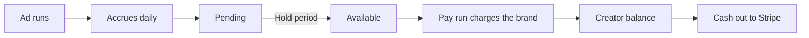

## Royalty terms

Terms live in **Settings**, under the **Royalty Terms** tab. The default set is inherited by every new creator, and any creator can be given their own.

| Field | What it does | Default |
|---|---|---|
| Payout model | How ad performance is priced. Three options, below | Percent of revenue |
| Rate | The percentage or amount the model reads | 5% |
| Submission fee | Paid once when a video is approved, on top of the model | None |
| Payout cap | The most a single video can ever earn | Uncapped |
| Hold period | Days before an earned balance becomes available | 14 days |
| Minimum payout | The floor a cash out has to clear | 10, in the workspace currency |
| Currency | The currency creators are paid in | USD |

<Callout kind="warning">
  The **payout schedule** field on a set of terms is a label describing your intent. It does not move money. Scheduled payment is configured separately, under [automatic pay runs](#automatic-pay-runs), because a workspace can hold several sets of terms and only one bank account.
</Callout>

## The three payout models

Every creator has exactly one base model.

| Model | How it prices a day |
|---|---|
| Percent of revenue | A share of the revenue that creator's ad brought in |
| Flat fee per order | A fixed amount for every order the ad drove |
| Meta performance | A rate against delivery rather than sales |

Meta performance is measured one of three ways: per 1,000 impressions, per click, or as a percent of ad spend. It pays on delivery, so a creator earns from a video even when it sells nothing. That is worth deciding on deliberately rather than discovering on a pay run.

## What layers on top

Three things sit on top of whichever base model is set.

<Columns cols={3}>
  <Card title="Submission fee" icon="file-check">
    A fixed amount paid once, the moment a video is approved. It does not wait for the video to run.
  </Card>
  <Card title="Retainer" icon="shield-check">
    A guaranteed floor per period, conditional on a volume goal.
  </Card>
  <Card title="Bonus" icon="gift">
    A discretionary amount, paid straight away and outside the payout cap.
  </Card>
</Columns>

A **retainer** is a floor rather than a fee. Set a floor amount, a period and a goal in approved videos. At the end of the period, if the creator met the goal, Hotline tops up the difference between their royalties and the floor. A creator who earned more than the floor gets no top up, because the floor was already cleared. Retainers are evaluated monthly, on the first of the month.

## Caps and freezing

A **payout cap** is the most a single video can ever earn. It is shared across every ad running that video, so duplicating a creative into four adsets does not multiply what it can pay out.

Terms are **frozen onto a video when it is approved**. Editing a creator's terms afterwards prices their new work and never touches work already approved. Two videos by the same creator can carry different terms, and each one reports against its own.

## From earning to bank account

Royalties accrue once a day, against the terms frozen on each video, stopping at that video's cap. An earning sits **pending** until the hold period has passed, then becomes **available**. Only available earnings can go into a pay run.

## Pay runs

A pay run is the brand paying. It charges you the creators' royalties plus Stripe's processing cost for the rail, and moves the money into each creator's Hotline balance.

The rail is decided by your payout currency: **BECS Direct Debit for Australian dollars, card for everything else**. BECS costs materially less and is capped, but it is a delayed method, so the debit clears about two business days after you authorise it rather than immediately.

<Callout kind="info">
  Hotline collects from the brand before it pays creators, so it never fronts the money. A creator's balance is credited when your payment succeeds, and settles to available two days later.
</Callout>

### Running one by hand

<Steps>
  <Step title="Open Payouts" icon="dollar-sign">
    Creators whose balance has cleared its hold period are listed with what they are owed.
  </Step>
  <Step title="Pick who to pay" icon="check">
    Tick the creators you want in this run. A single run cannot mix currencies.
  </Step>
  <Step title="Pay" icon="credit-card">
    Hotline prices the run, locks those earnings so a second run cannot claim them, and hands you a Stripe checkout page.
  </Step>
</Steps>

### Automatic pay runs

A schedule charges a saved payment method without anyone opening Stripe.

<Steps>
  <Step title="Save a payment method" icon="landmark">
    From **Payouts** or **Settings**, authorise a payment method to be charged when you are not present. For AUD that is a BECS Direct Debit mandate.
  </Step>
  <Step title="Choose a cadence" icon="calendar-clock">
    Every week, every two weeks, or every month, with the day you want. Runs are anchored to 9am Melbourne time, which keeps every debit inside the BECS same day cutoff.
  </Step>
  <Step title="Set a per creator minimum" icon="filter">
    A creator below it sits out the run and their earnings stay available for the next one, so you are never charged a processing fee to move money into a balance the creator cannot withdraw yet. Leave it blank to inherit the minimum payout on your terms.
  </Step>
</Steps>

<Callout kind="warning">
  A weekend date is honoured rather than quietly moved. BECS processes it on the next business day either way, and shifting the date would make the next run date you are shown untrue.
</Callout>

Hotline emails you when a scheduled debit is submitted, since nobody clicked it, and again if it fails.

What a failure does to the schedule depends on the kind. A declined debit that could succeed later, most often insufficient funds, earns exactly one retry three business days out, and the earnings return to available in the meantime. Should that second attempt fail too, the schedule pauses, because debiting an account that has already bounced twice costs you another dishonour fee and gets creators paid no sooner. Two kinds of failure skip the retry entirely and pause on the spot: a bank that cancelled the authorisation, and a run larger than your direct debit limit. Neither can succeed on a second try.

Manual runs ignore the per creator minimum, because there you are choosing explicitly.

## Cash outs

A pay run puts money into a creator's Hotline balance. A cash out moves it from there into their own bank account, through the Stripe Connect account they onboarded themselves.

Creators can cash out whenever their available balance clears the minimum payout. They can also turn on **automatic cash outs** and set their own threshold, which is swept once a day.

<Callout kind="info">
  A creator has to finish Stripe onboarding before any balance can leave Hotline. Until they do, earnings still accrue and still settle, they simply cannot be withdrawn.
</Callout>

## Related

<Columns cols={2}>
  <Card title="Your earnings" icon="wallet" href="/for-creators/earnings" horizontal>
    The same flow from the creator's side.
  </Card>
  <Card title="Integrations" icon="plug" href="/integrations#stripe" horizontal>
    How Stripe Connect is set up.
  </Card>
</Columns>
